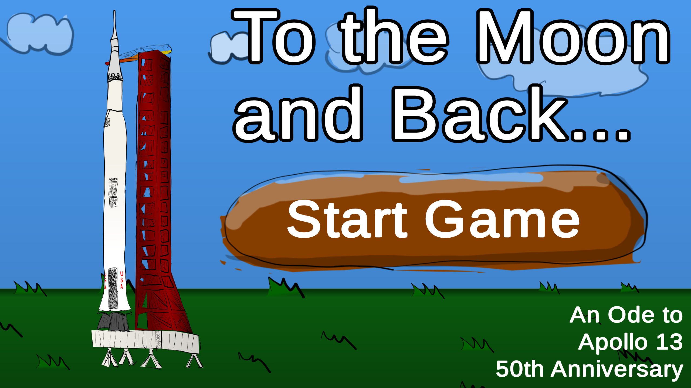
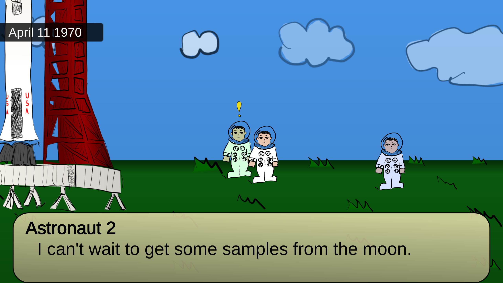
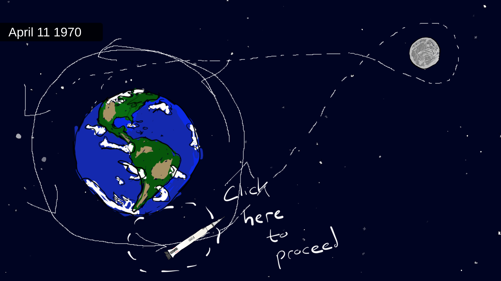
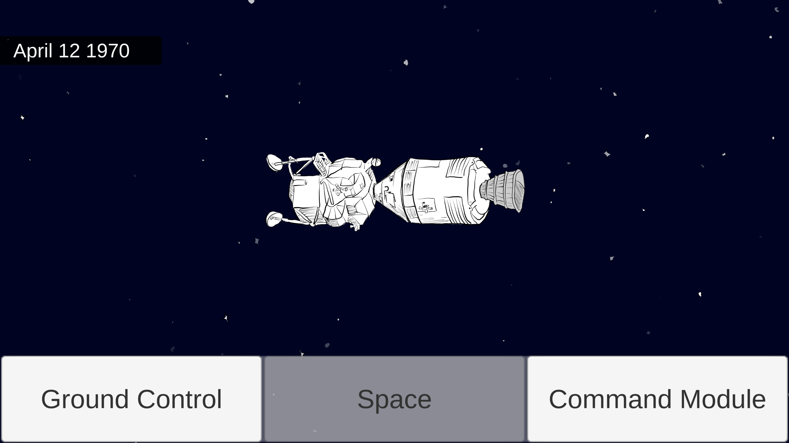
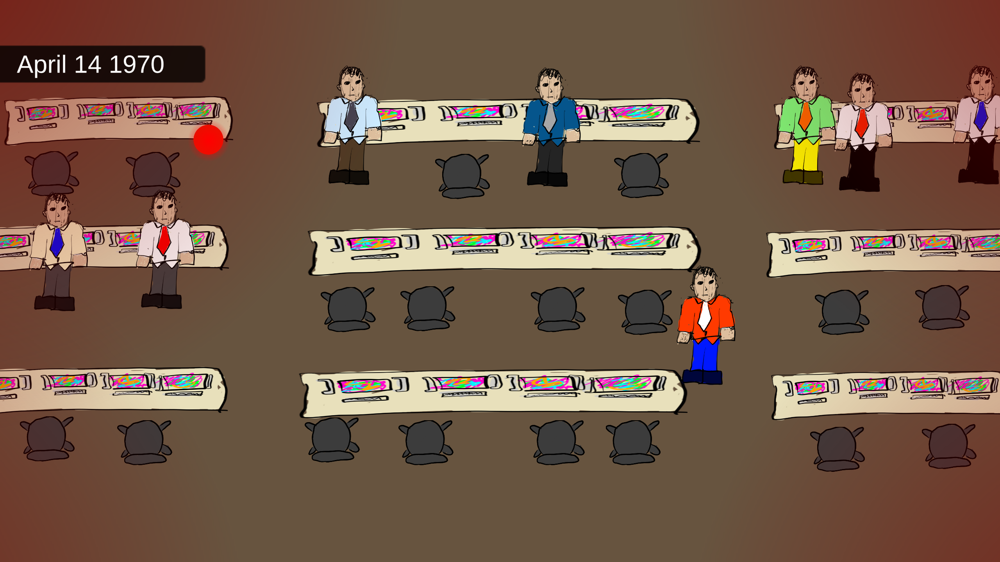
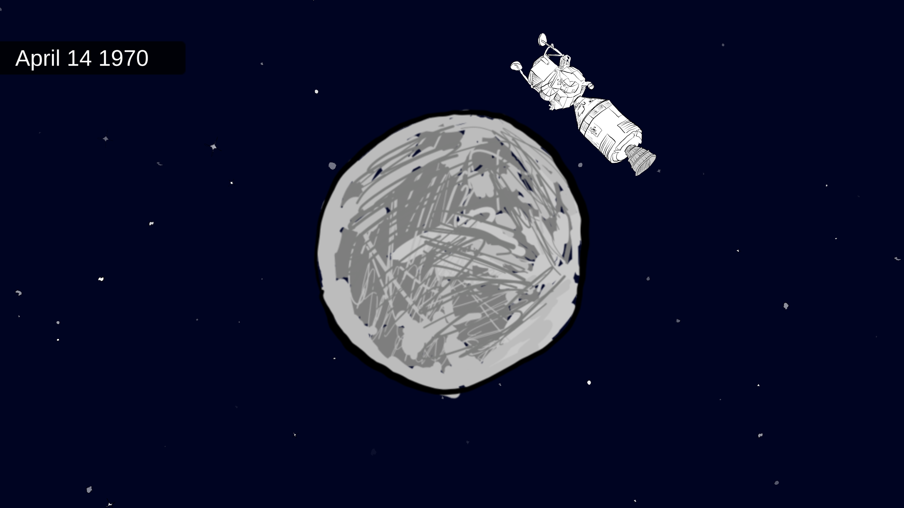
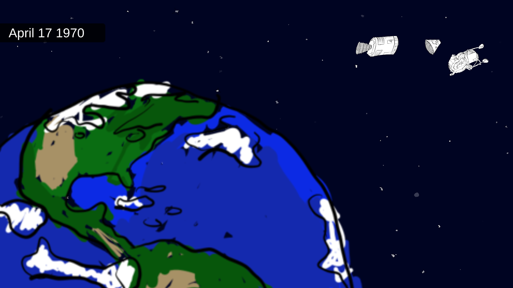

## [To the Moon and Back...](https://ldjam.com/events/ludum-dare/46/to-the-moon-and-back)
*COMPO GAME by ETdoFresh*

Experience a unique telling of the Apollo 13 mission. This was an ode for the 50th anniversary. It was tough making a story driven game :). Maybe I’ll learn my lesson for next time.

### Play Game
HTML5 (web) https://etdofresh.github.io/LudumDare46

### Controls
Movement (WASD or Arrows)
Interact (Space or Left Click)

### Watch Playthrough

### Screenshots
Title Screen  

Embarking  

The Plan!  

Flying through space  

Red Alert!  

Around the moon!  

Home at last!  

### Youtube Playlist
Watch me create this game in realtime… as fun as that could be?? :p  
https://www.youtube.com/playlist?list=PL3n_16RyJxmY-y-x_Hf16jYEc01oq-g6z

### Compo Note…
All assets, code, and graphics were done by me in the allotted time. Sorry for grown man making 5-year old drawings. Hahaha
